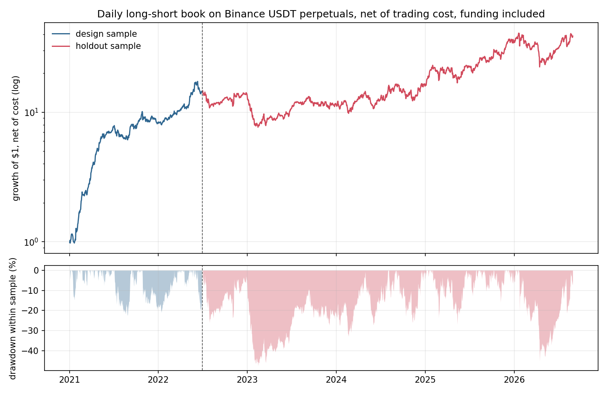
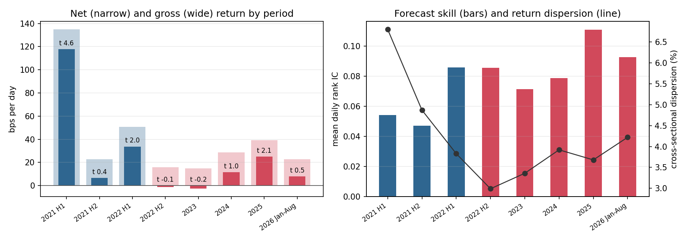

# crypto-xs-perps

A daily cross-sectional long-short book on Binance USDT-margined perpetual futures. Each day two models rank about 100 coins on 32 features built from hourly bars and funding rates, one a ridge regression and the other gradient-boosted trees. The book was developed on January 2021 to June 2022. A holdout from July 2022 to August 2026 stayed sealed until the design was frozen and was then read once.

The design sample netted 52.45 bps a day after trading cost, with a Newey-West t of 3.91. On the holdout the same book netted 9.30 bps a day with t 1.58, short of the 2.00 hurdle fixed before the read, so the design result is not confirmed out of sample. Forecast skill held up on the holdout, with a mean daily rank IC of 0.088 against 0.062 in design. Gross return fell from 69 to 25 bps a day as cross-sectional dispersion shrank and the book became a net payer of funding.

## Results

| | Design | Holdout |
|---|---|---|
| Decision days | 2021-01-01 to 2022-06-28 | 2022-07-01 to 2026-08-30 |
| Booked days | 543 | 1,520 |
| Cost per unit of turnover | 16.93 bp | 17.93 bp |
| Net return, bps/day | 52.45 | 9.30 |
| Newey-West t, 10 lags | 3.91 | 1.58 |
| Block bootstrap 95% interval, bps/day | 27.3 to 78.7 | -2.4 to 20.9 |
| Gross return, bps/day | 69.14 | 25.34 |
| Funding earned, bps/day | 5.53 | -5.25 |
| Daily turnover | 0.99 | 0.90 |
| Annualized Sharpe ratio | 3.99 | 0.75 |
| Skew; excess kurtosis | 0.74; 5.04 | -0.60; 4.58 |
| Maximum drawdown | -22.4% | -47.5% |
| Mean daily rank IC with the next-day perp return | 0.062 | 0.088 |
| Mean cross-sectional dispersion of daily returns | 5.17% | 3.66% |
| Correlation with the equal-weight market | -0.17 | -0.46 |
| $10,000 at the end of the sample | $144,866 | $26,765 |

Returns run from one 00:00 UTC close to the next and include every funding settlement in between. Gross and net figures both include funding. The bootstrap uses circular blocks of 10 days.





| Period | Days | Net, bps/day | t | Gross, bps/day | Funding, bps/day | Rank IC | Dispersion |
|---|---|---|---|---|---|---|---|
| 2021 H1 | 180 | 117.88 | 4.58 | 134.93 | 11.11 | 0.054 | 6.80% |
| 2021 H2 | 184 | 6.60 | 0.39 | 22.68 | 5.46 | 0.047 | 4.87% |
| 2022 H1 | 179 | 33.78 | 2.05 | 50.76 | -0.02 | 0.086 | 3.83% |
| 2022 H2 (holdout) | 183 | -1.11 | -0.08 | 15.80 | -2.08 | 0.086 | 2.99% |
| 2023 | 365 | -2.70 | -0.24 | 14.76 | -1.83 | 0.071 | 3.36% |
| 2024 | 366 | 11.68 | 1.00 | 28.62 | 0.67 | 0.079 | 3.92% |
| 2025 | 365 | 24.95 | 2.15 | 39.07 | -10.53 | 0.111 | 3.68% |
| 2026 Jan to Aug | 241 | 8.03 | 0.45 | 22.87 | -13.84 | 0.093 | 4.22% |

### Reading the results

Most of the design return came from the first half of 2021, when dispersion was highest; the second half of 2021 netted 6.6 bps a day. On the holdout the rank IC stayed between 0.071 and 0.111 in every year. Dispersion averaged 3.66%, so the same ranking skill bought less spread between winners and losers, and gross fell to 25 bps a day against about 16 bps a day of cost. The book also carried a short tilt to the market that it lacked in design (correlation -0.46 against -0.17) and paid funding on net, most heavily in 2025 and 2026. Its largest drawdown ran from the first holdout day through the 2022 bear market and the FTX collapse to a trough on 2023-02-14, and the book regained that peak on 2024-08-01. Only 2025 cleared the hurdle on its own.

## The holdout test

The test was fixed before the read as a one-sided Newey-West t statistic with 10 lags on daily net returns, against a hurdle of 2.00. Development ran 142 trials whose daily returns had a mean pairwise correlation of 0.71. Scaling the expected maximum of 142 standard normals (2.65) by the square root of one minus that correlation gives 1.43, below the conventional floor of 2.0, so the floor governs (Bailey and López de Prado, 2014). Because machine-learning books on the crypto cross-section are already published (Cakici et al., 2024), the power calculation assumed the holdout would keep 42% of the design effect; at that effect, net of the extra basis point of fee, power was 0.73. The non-rejection therefore moves the odds against the design effect by about 3.6 times and stops short of showing the effect is absent.

From the development record, the design-sample deflated Sharpe ratio was 0.985 to 0.999. The probability of backtest overfitting, from 16-block combinatorial splits of 76 captured trial series, ranged from 0.06 to 0.22 across block offsets. An earlier spot-only window (April 2019 to April 2020) gave a deflated Sharpe of 0.66 to 0.70. The trial return matrix behind these figures is not part of this repository.

## Method

### Universe

Each month the universe holds the 100 Binance spot USDT pairs with the highest quote volume over the trailing 90 days, measured through the end of the previous month. A member stays while it ranks 120th or better and a newcomer enters at 80th or better, which cuts monthly churn by about 60% against a plain 30-day top 100. Stablecoin bases, fiat bases, leveraged tokens and wrapped coins are left out. On a given day a coin enters the panel when it is in the universe with at least 20 hourly spot bars. The panel also requires defined order-flow features, today's return, a 20-day volatility and a next-day spot return. Trading happens in the coin's perpetual, on days when the perpetual has a next-day return and a funding figure.

### Features

Every feature is measured at 24:00 UTC, when the book forms. Features are Gaussian-ranked across coins each day, and a missing value becomes zero. Imbalance means taker-buy quote volume minus taker-sell quote volume, over total quote volume.

| Group | Feature | Definition |
|---|---|---|
| Order flow | `flow` | today's spot imbalance minus its mean over the previous 20 days |
| | `flow_persist` | mean sign of hourly imbalance against that 20-day mean |
| | `flow_steady` | t statistic of the hourly deviations from it |
| | `trade_size` | sign of `flow` times the log of average trade size over its 20-day median |
| | `signed_volume` | sign of `flow` times the log of quote volume over its 20-day mean |
| | `late_flow` | imbalance over 18:00 to 24:00 UTC minus the 20-day mean |
| Price and liquidity | `ret_1d` | today's return |
| | `mom_7d`, `mom_30d` | 7-day and 30-day returns ending yesterday |
| | `max_ret_30d` | largest daily return over the previous 30 days |
| | `vol_20d`, `skew_168h` | 20-day volatility of daily returns; skewness of the last 168 hourly returns |
| | `log_volume`, `volume_shock` | log quote volume; log quote volume over its 20-day mean |
| | `amihud` | log 20-day Amihud illiquidity |
| | `dist_90d_high`, `log_age` | log distance below the 90-day high; log days since the coin's first Binance bar |
| | `asia_minus_us` | 7-day sum of the 00:00 to 08:00 UTC return minus the 13:00 to 21:00 UTC return |
| Market links | `btc_catchup` | 60-day beta to BTC times BTC's 18:00 to 24:00 UTC return, minus the coin's own return over those hours |
| | `down_beta` | beta to BTC over BTC's down days in the last 60 days |
| | `spx_move` | yesterday's 60-session beta to the S&P 500 times today's S&P 500 return, zero without a session |
| Perpetual and funding | `basis` | log perpetual close over spot close |
| | `flow_gap`, `perp_share` | perpetual imbalance minus spot imbalance; log perpetual share of combined volume against its 20-day mean |
| | `funding`, `funding_change` | the 00:00 UTC funding rate fixed as the book forms, in 8-hour terms; its change from the previous day |
| | `funding_vs_basis` | rank of funding minus rank of basis, ranked again |
| Squeeze proxies | `up_jumps_30d` | hourly spot moves above 5% over 30 days |
| | `cascades_7d` | hours in the last 7 days with volume above 5 times its 30-day hourly median and a move larger than 3% |
| | `perp_flow_lead_3d`, `perp_discount_3d` | 72-hour perpetual imbalance minus spot imbalance; hours of the last 72 with the perpetual below spot |
| | `neg_funding_9` | negative prints among the last nine 00, 08 and 16 UTC funding fixes |

### Target and models

The target weights the next five days' returns at 0.5, 0.25, 0.125, 0.0625 and 0.03125. Each day's returns are demeaned across coins and divided by that day's cross-sectional standard deviation first, and the weighted sum is clipped at plus or minus 5. Ridge regression chooses its penalty from 0 and 100 up to 10 million. Scikit-learn's histogram gradient boosting runs with learning rate 0.05, 15 leaves, at least 500 rows per leaf, L2 penalty 1 and 25 to 400 rounds. Both refit every month on an expanding window that ends 7 days before the month, so no training target overlaps the test month. The last 60 training days pick the penalty and the number of rounds by the top-minus-bottom decile spread of next-day spot returns, and the chosen setting is refit on the whole window.

### Book

Each day each model's forecast is regressed across coins on the coin's ranked 30-day momentum, and the fitted part is removed. Both models then go long their top decile and short their bottom decile of tradable coins. Weights within a leg are proportional to one over the 20-day volatility, floored at the day's 10th percentile, and each leg sums to one. The two models' books are averaged to a target, and the held book moves halfway from yesterday's drifted weights to that target each day. Cost is charged on turnover against the drifted weights.

### Cost

The one-way spread of 12.93 bp starts from a quoted half-spread of 11.0 bp for Binance coins trading about $20M a day (Wu, Foley and Svec, 2024 working paper). Scaling by 1.14 for perpetuals over spot and by 1.031 for the funding hour (Ruan and Streltsov) gives the 12.93. The taker fee was 4 bp in the design period and is 5 bp, Binance's regular-user rate, across the holdout. In the design sample about 2% of traded weight went to coins trading less than $20M a day.

### Data rules

A day's funding is the sum of every settlement after the book forms through the next 00:00 UTC fix, so 8-hour, 4-hour, 1-hour and emergency settlements are all charged. The day counts only when that closing fix exists and the settlements cover 24 hours. Where a coin has a score and funding but no perpetual return that day, its spot return stands in (329 coin-days in design, 61 in the holdout). A perpetual whose bars stop for good exits at its last hourly close with funding settled up to then.

## Data note

The hourly perpetual files behind the results above lack the 00:00 UTC bar on the first day of each month from January 2022 on. Binance added a header row to those files that month, and the original download read the first data row of each file as the header. The download code in this repository keeps that row. Perpetual returns and `basis` use the 23:00 UTC close and are unaffected. On and after the first of each month the gap touches the inputs built from perpetual volume and imbalance (`flow_gap`, `perp_share`, `cascades_7d`, `perp_flow_lead_3d` and `perp_discount_3d`), so a fresh download will give slightly different features. The holdout was read once and is not re-run on corrected files.

## Running it

Python 3.10 or later. About 2 GB of hourly parquet files come from the public Binance archive at data.binance.vision, which needs no API key. The S&P 500 series comes from Yahoo Finance.

```bash
python -m venv .venv && source .venv/bin/activate
pip install -r requirements.txt
python pipeline.py download    # Binance hourly klines and funding, plus S&P 500 closes
python pipeline.py universe    # monthly top-100 universe
python pipeline.py features    # features and perp returns, block by block
python pipeline.py fit         # monthly walk-forward, 2021-01 to 2026-08
python pipeline.py report      # design and holdout books, output/summary.json
python pipeline.py figures     # figures/
```

Each stage skips work already on disk. On four cores the feature build takes about 25 minutes and the walk-forward about 20. Inputs go to `data/` and results to `output/`; git ignores both.

## Layout

| File | Contents |
|---|---|
| `pipeline.py` | stage runner |
| `crypto_xs/config.py` | dates, samples, costs, symbol filters |
| `crypto_xs/download.py` | Binance archive and S&P 500 downloads |
| `crypto_xs/universe.py` | monthly top-100 universe |
| `crypto_xs/inputs.py` | readers for the downloaded inputs |
| `crypto_xs/features.py` | daily features and squeeze proxies |
| `crypto_xs/perps.py` | next-day perpetual return and funding |
| `crypto_xs/models.py` | target, ridge regression, boosted trees and the monthly walk-forward |
| `crypto_xs/portfolio.py` | momentum neutralization, decile legs, partial trading and cost |
| `crypto_xs/report.py` | summary statistics and the holdout test |
| `crypto_xs/plots.py` | README figures |

## References

- Bailey, D. H. and M. López de Prado (2014). The deflated Sharpe ratio. *Journal of Portfolio Management* 40(5), 94-107.
- Bailey, D. H., J. M. Borwein, M. López de Prado and Q. J. Zhu (2017). The probability of backtest overfitting. *Journal of Computational Finance* 20(4), 39-69.
- Cakici, N., S. J. H. Shahzad, B. Będowska-Sójka and A. Zaremba (2024). Machine learning and the cross-section of cryptocurrency returns. *International Review of Financial Analysis* 94.
- Newey, W. K. and K. D. West (1987). A simple, positive semi-definite, heteroskedasticity and autocorrelation consistent covariance matrix. *Econometrica* 55(3), 703-708.
